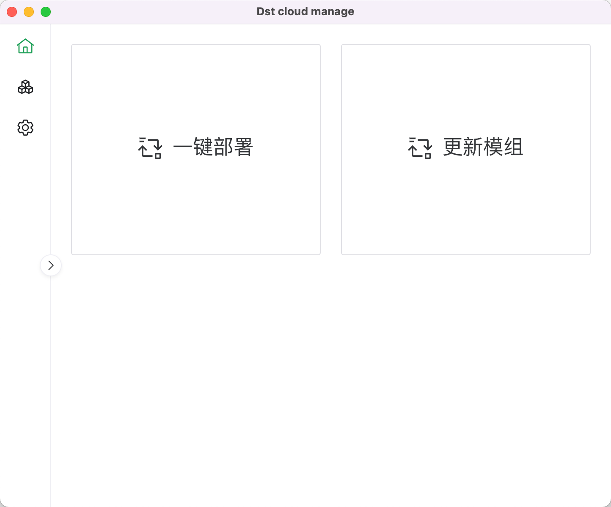
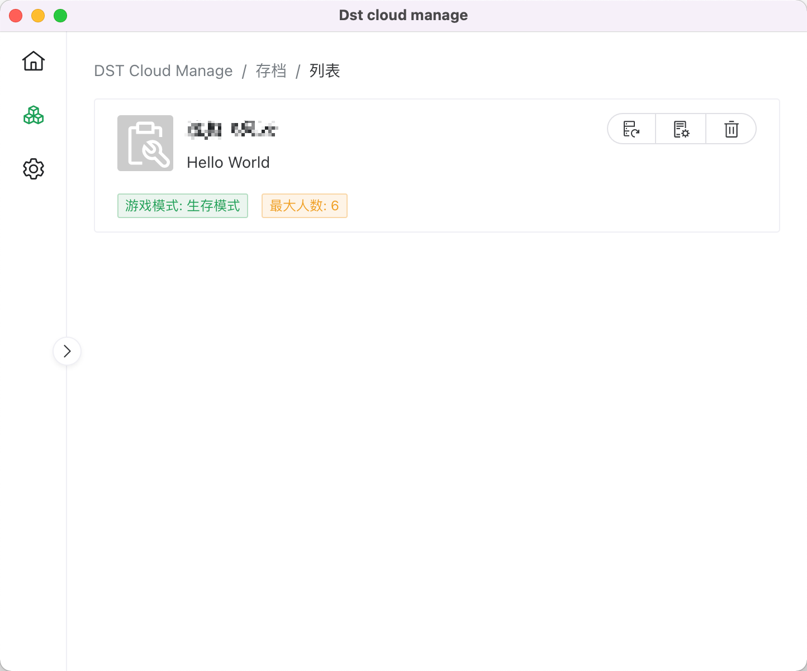
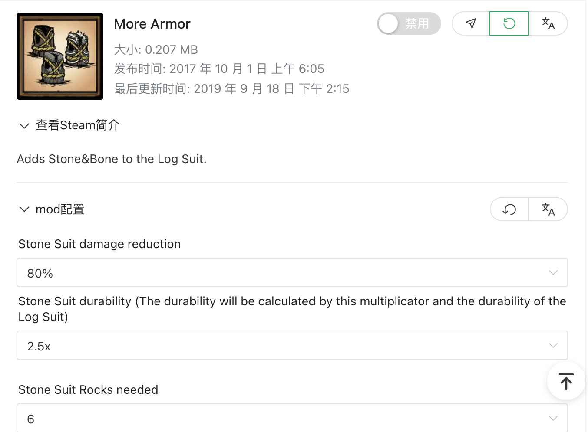
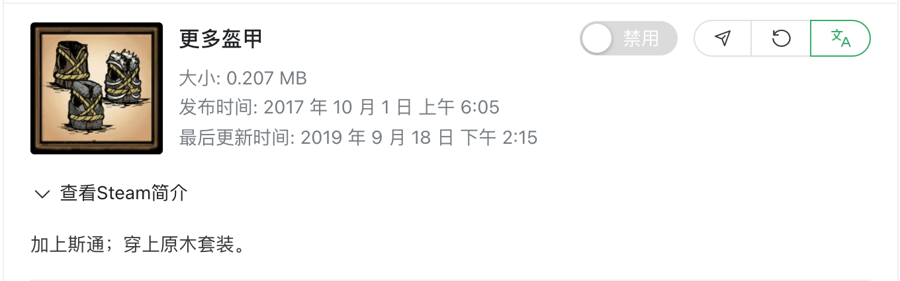
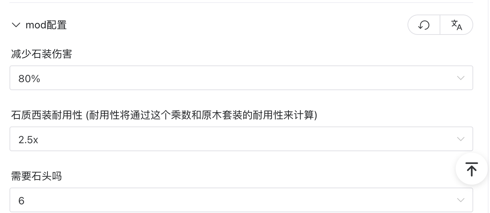
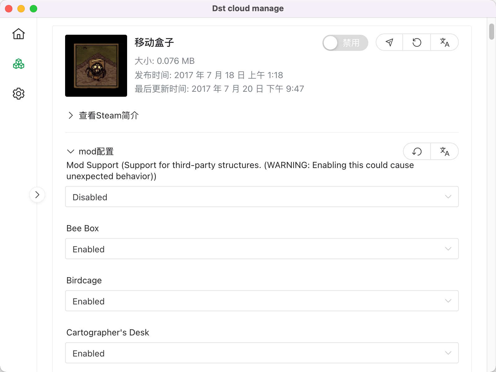
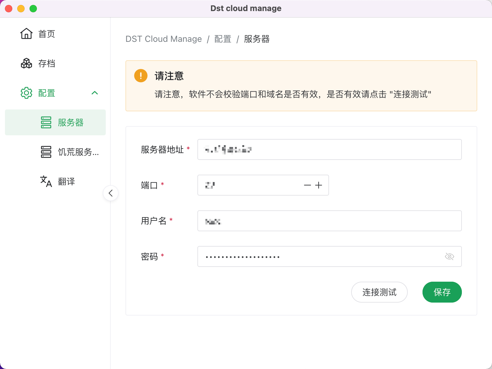
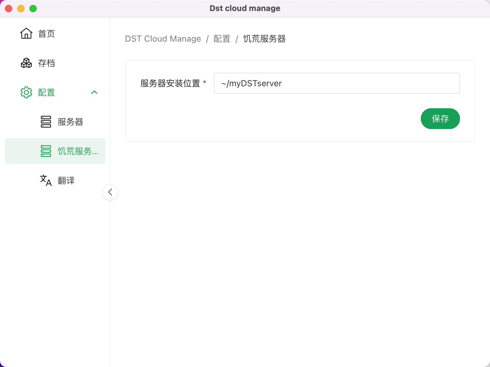
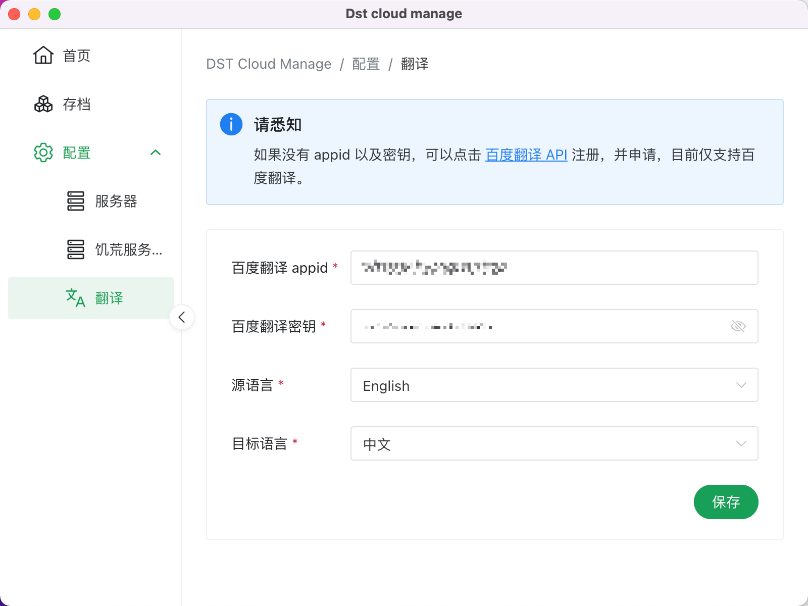

# dst-cloud-manage

## Overview

这是一个饥荒联机版的服务器管理工具，包含一键部署，mode管理等功能

### 目前的功能

- 一键部署（仅支持 Ubuntu, 仅在 Ubuntu 16.04 server 64bit 下测试过）
- 更新模组（更新已经安装的所有模组）



###  存档管理

- 每个存档右边目前都有三个按钮（备份存档｜模组设置｜删除存档）
- 每个存档底下如果有配置的话可以读取到标签



### 模组配置

模组功能介绍

- 【强制刷新】用于某些模组已经过期或者数据不全的情况
- 每个模组右上角目前都有一些操作（启用/禁用模组｜打开 Steam 创意工坊｜强制刷新单个模组｜翻译模组）
- 每个模组底部必有一个 Steam 创意工坊简介
- 根据每个模组不同，会有多一个 mod 配置


##### 翻译功能
翻译之前


模组翻译



配置翻译



##### mod 配置

每个配置底部都有应用按钮，可以直接应用到存档



### 各种配置







## TODO
- [ ] 添加新模组
- [ ] 添加新存档
- [ ] 存档编辑
- [ ] 存档管理员/黑名单
- [ ] 服务器功能呢（关闭/指令）
- [ ] 一键更新服务器
- [ ] 更多翻译 API
- [ ] 定时更新服务器
## Run Setup

  ```bash
  # clone the project
  git clone git@github.com:FuBaooo/dst-cloud-manage.git

  # enter the project directory
  cd dst-cloud-manage

  # install dependency
  pnpm i

  # develop
  pnpm dev
  ```

## Directory

```tree
├
├── dist                      构建之后的目录
├   ├── main
├   ├── preload
├   ├── renderer
├
├── scripts
├   ├── build.mjs             Develop script -> 构建脚本
├   ├── watch.mjs             Develop script -> 开发校本
├── utils                     工具函数
├── packages
├   ├── main                  主线程源代码
├       ├── vite.config.ts
├   ├── preload               预加载源代码
├       ├── vite.config.ts
├   ├── renderer              主线程源代码
├       ├── locales           语言包
├       ├── src               
├            ├── pages        页面由路径自动生成
├            ├── modules      装载的模块
├            ├── store        数据存储
├            ├── utils        工具函数/与主线程通讯函数
├            ├── auto-imports 自动导入库函数
├            ├── components   自动导入组件
├       ├── vite.config.ts
```